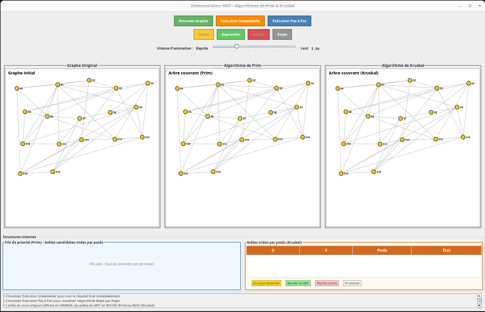
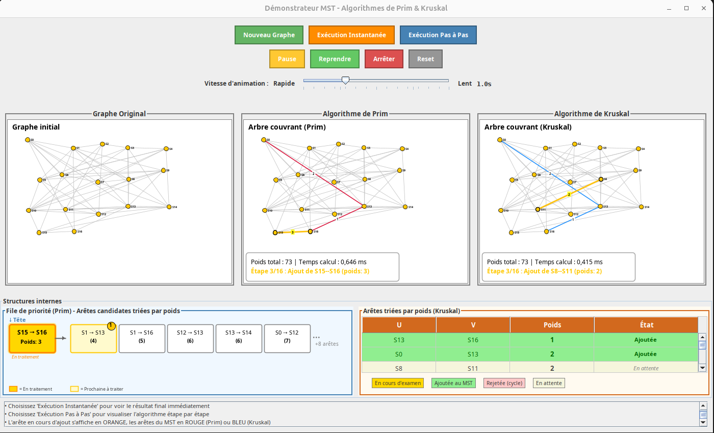
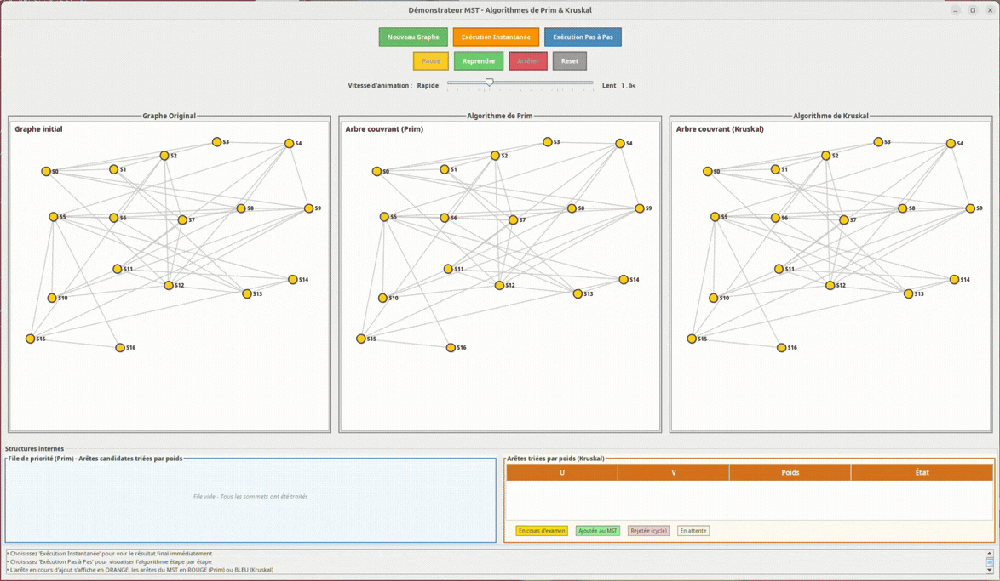
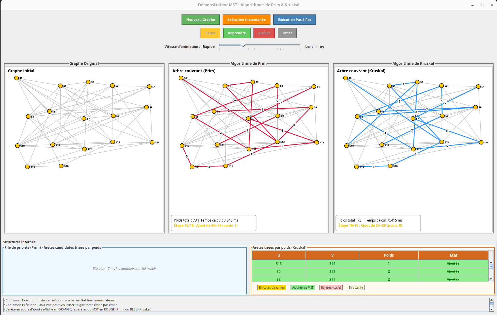

# Demonstrator-MST
**Démonstrateur pédagogique du calcul d’un arbre couvrant minimal (Minimum Spanning Tree)**

Ce démonstrateur illustre le fonctionnement du calcul d’un **MST** à l’aide des algorithmes de **Prim** et **Kruskal**.

Le projet est développé en **Java avec Swing** et propose une simulation visuelle permettant de suivre les différentes étapes de construction d’un MST sur un graphe généré aléatoirement.

---

## Aperçu



Le démonstrateur permet :


- de comprendre le calcul d’un **Minimum Spanning Tree**
- de visualiser l’exécution des algorithmes **Prim** et **Kruskal**
- d’observer **la construction progressive de l’arbre couvrant**
- de comparer les **temps d’exécution des deux algorithmes**

---

## Objectifs pédagogiques

Nous avons réalisé ce démonstrateur dans notre option de découverte d'un domaine de l'informatique.

Dans cette partie d'option **Algorithmique probabiliste** nous avons essayé de proposer un démonstrateur pour pouvoir expliquer du mieux possible :

- le principe d’un **graphe pondéré non orienté**
- la notion d’**arbre couvrant minimal**
- le fonctionnement des algorithmes **Prim** et **Kruskal**
- les différentes **étapes de sélection des arêtes**
- la comparaison entre deux approches algorithmiques

Le démonstrateur permet de suivre l’évolution et  la construiction progressive de l’arbre couvrant minimal.

---

# Moyens utilisés

- **Java**
- **Swing** – interface graphique
- **Ant** – système de build
- **Javadoc** – documentation

---

## Installation et exécution

Le projet utilise **Ant** pour la compilation et l’exécution.

### Lancer le démonstrateur

```bash
ant
```

Cette commande va permettre de : 
1. Compiler le projet
2. Générer la javadoc
3. Lancer l'application

Le codu du démonstrateur se trouve dans :
```
/demonstrateur-mst/Demonstrateur
```

---

## Commandes Ant
Compiler le code :
```bash
ant compile
```
Générer la documentation du code :
```bash
ant javadoc
```
Exécuter le programme :
```bash
ant run
```
Nettoyer les fichiers de documentation et compiler :
```bash
ant clean
```

---

## Fonctionnement du démonstrateur

Le démonstrateur permeet de générer un graphe aléatoire **non orienté, connexe et pondéré**

---

### Génération d'un graphe

Le bouton ***Nouveau graphe*** permet de générer un nouveau graphe aléatoire.

### Modes d'éxécutions

Chaque algorithme peut être exécuté de deux façons.

### Exécution instantanée
Le démonstrateur calcule immédiatement :

- l’arbre couvrant minimal avec Prim
- l’arbre couvrant minimal avec Kruskal

Le résultat final est directement affiché.


### Exécution pas à pas
Ce mode permet de visualiser la construction progressive du MST.

Les étapes sont affichées automatiquement avec un délai ajustable



Durant l'exécution :

- l’arête en cours de traitement est mise en surbrillance
- le poids de l'arête sélectionnée est affichée
- la file de priorité s'actualise au fur et à mesure du tri
- le tableau des sommets s'actualise au fur et à mesure du tri
- l'arbre couvrant se construit progressivement



#### Résultat final
A la fin de l'exécution :
- on obtient l'arbre couvrant minimal pour le graphe
- le poids **total** des arêtes est calculé
- le **temps d'exécution** de Prim et de Kruskal est affiché



---

### Contrôles disponibles

Les boutons permettent de : 
- Générer un **nouveau graphe**
- Exécuter **instantanément**
- Mettre en **pause**
- Reprendre le **tri**
- Arrêter le **tri**
- Réinitialiser le graphe


### Structure du projet

Comme nous le réalisons souvent en projet nous avons séparé le projet dans une logique MVC

```
src/
src/
├─ model/        # Structures de données et algorithmes de graphes
├─ view/         # Interface graphique Swing
├─ controller/   # Gestion des interactions et du déroulement
build.xml        # Configuration Ant
```
--- 

#### Améliorations possibles
 
 Plusieurs extensions pourraient améliorer ce démonstrateur :

- permettre à l’utilisateur de créer son propre graphe
- ajouter d'autres algorithmes de MST
- permettre une comparaison visuelle détaillée des performances
 
 
---

# Auteurs
- Matthieu **Thomas** (https://github.com/Matthieu-Thomas)
- Basile **Tellier**
